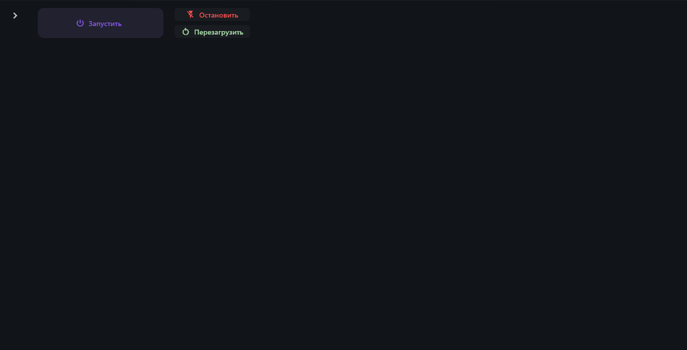
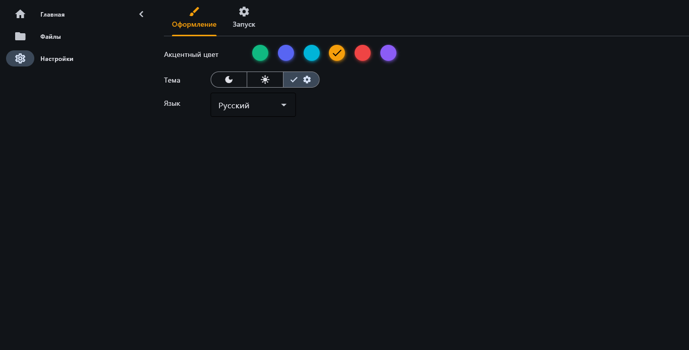
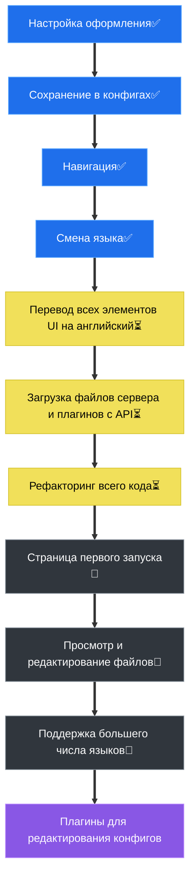

# CubeConsole

### Простой создатель Minecraft-серверов с GUI интерфейсом и открытым исходным кодом

## Идея

CubeConsole был создан для упрощения создания серверов при помощи GUI интерфейса, генерации команд запуска, менеджера плагинов и удобного редактора конфигурационных файлов в одном приложении. 

## Скриншоты
<figure>
    
    <figcaption><i>Главная страница</i></figcaption>
</figure>

<figure>
    
    <figcaption><i>Страница оформления</i></figcaption>
</figure>

## Роадмап

#### Лицензия

GPL-3.0